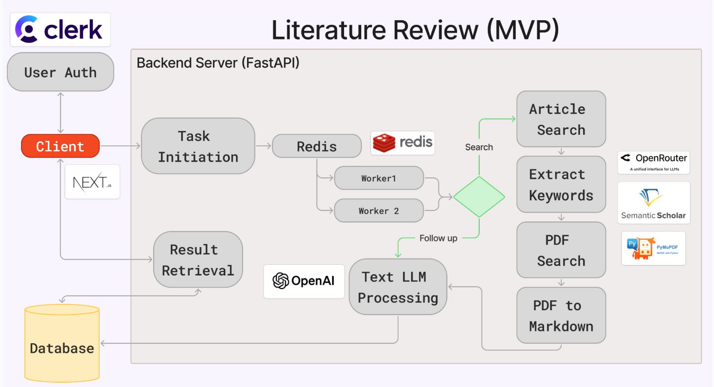
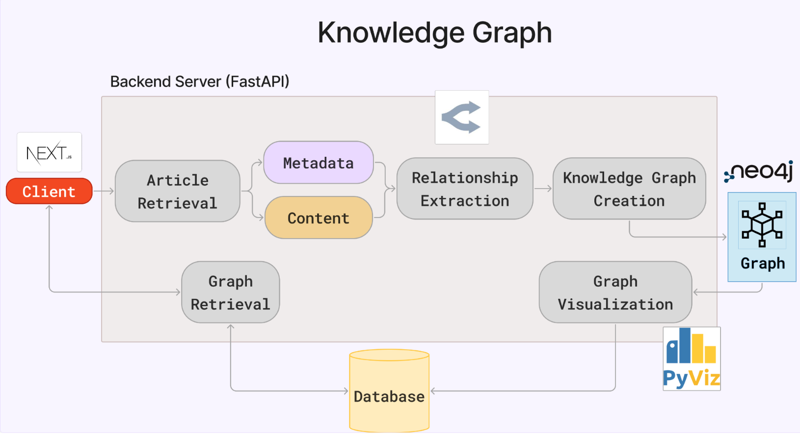

# Academico AI

## Overview

Welcome to **Academico AI**! This repository is part of the **CS/DS 519 Software Engineering X-lab Practicum** at Boston University. The goal of this project is to build a platform that uses AI and large language models (LLMs) to automate academic paper search, analysis, and knowledge graph creation. It provides researchers with a single platform for all their research needs, streamlining the process and fostering collaboration.

---

## Table of Contents

1. [Project Overview](#overview)
2. [Setup/Running the Project](#getting-started)
3. [Technology Stack](#technology-stack)
4. [How to Contribute](#how-to-contribute)
5. [Project Structure](#project-structure)
6. [Resources](#resources)
7. [Steps](#steps)
7. [Maintainers](#maintainers)

---

## Getting Started

### Prerequisites

Ensure you have the following installed:

- [Node.js](https://nodejs.org/)
- [Python 3.11+](https://www.python.org/)
- [MySQL](https://dev.mysql.com/)
- [Git](https://git-scm.com/)

### API Keys

- [Neo4j Desktop or Aura](https://neo4j.com/)
- [OpenRouter API Keys](https://openrouter.ai/)
- [OpenAI API Key](https://openai.com/api/)
- [Semantic Scholar API Key (Optional)](https://www.semanticscholar.org/product/api)
  
It is necessary to have an OpenAI API Key, an OpenRouter API Key, and 2 Neo4J Aura instances. 

OpenAI is a paid API key. 

It is possible to use the project with a free OpenRouter API Key, but the project performs better with paid models.

A Semantic Scholar API Key is not necessarily required, but be mindful that without one, the project uses public shared bandwidth. 

### Setup/Running Project

1. Clone the repository:

   ```bash
   git clone https://github.com/BU-Spark/se-academico-ai.git
   cd se-academico-ai
   git checkout dev

   ```

2. Set up the backend:

   ```bash
   cd backend
   python -m venv venv
   .\venv\Scripts\activate  # (On Windows PowerShell)
   pip install -r requirements.txt
   ```

3. Install Rust
   ```
   https://rustup.rs # (For Windows)

   brew install rustup-init # (For Mac OS)
   rustup-init

   Verify Installation
   rustc --version
   cargo --version
   ```

4. Set up the frontend:
   ```bash
   cd ../frontend
   npm install
   ```


### Backend

1. Navigate to the backend folder and activate the virtual environment:

   ```bash
   python -m venv venv
   pip install -r requirements.txt
   ./venv/Scripts/Activate.ps1  #Windows

   source venv/bin/activate #Mac
   ```

2. Run the server:

   ```bash
   uvicorn main:app --reload
   ```
3. Activate the Neo4j Aura database instances
  
   https://login.neo4j.com/u/login/identifier?state=hKFo2SB3c0lHeFpReklWTEdDR2QtLXdlSkM2alFCOGFnYnZFZKFur3VuaXZlcnNhbC1sb2dpbqN0aWTZIFZkMUJuODVvZzRwSkRiNGFpYlRFdndnNmRwSWo5eHBxo2NpZNkgV1NMczYwNDdrT2pwVVNXODNnRFo0SnlZaElrNXpZVG8
   

4. To deactivate:
   ```bash
   deactivate
   ```


### Frontend

1. Navigate to the main directory and run the development server:
   ```bash
   npm install
   npm run dev
   ```

---


## Technology Stack

**Frontend**:

- TypeScript
- React
- Next.js

**Backend**:

- Python
- FastAPI
- OpenRouter/OpenAI
- MySQL
- Neo4j

---

## Technical Architectures





## How to Contribute

We welcome contributions from all students! Whether it’s improving UI/UX, enhancing LLM prompts, optimizing backend performance, or fixing bugs, your help is appreciated.

### Contribution Guidelines

1. **Fork the Repository**  
   Click "Fork" at the top-right of the repo page.

2. **Clone Your Fork**

   ```bash
   git clone https://github.com/your-username/se-academico-ai.git
   cd se-academico-ai
   ```

3. **Create a Branch**

   ```bash
   git checkout -b feature/your-feature-name
   ```

4. **Push and Open a PR**

   ```bash
   git push origin feature/your-feature-name
   ```

   Then open a Pull Request from GitHub.

---

## Project Structure

```
se-academico-ai/
│
├── backend/                     # FastAPI server
│   ├── main.py                  # API entry point
│   ├── requirements.txt         # Python dependencies
│   ├── app/                     # API logic, models, and routers
│   ├── metadata/                # Metadata-related files
│   ├── papers/                  # Folder for papers
│   ├── markdown_papers/         # Folder for markdown files
│   └── tasks.db                 # SQLite database (temporary)
│
├── app/                         # Next.js frontend
│   ├── api/                     # API routes
│   ├── chatbox/                 # Contains components search page
│   │   ├── chatHistory.tsx
│   │   ├── graph.tsx
│   │   ├── chatBox.tsx
│   │   ├── page.tsx
│   │   └── ...
│   ├── ui                       # Various UI components
│   │   └── global.css
│   ├── page.tsx                 # Main page for app
│   └── package.json             # Node.js dependencies
│
├── .gitignore                   # Git ignore rules
├── README.md                    # Project overview and instructions
└── pnpm-lock.yaml               # Lockfile for dependencies
```

---

## Resources

### Documentation

- [Next.js Docs](https://nextjs.org/docs)
- [FastAPI Docs](https://fastapi.tiangolo.com/)
- [Neo4j Docs](https://neo4j.com/docs/)
- [OpenRouter API](https://openrouter.ai/docs)

### Tutorials

- [Connecting FastAPI and React](https://testdriven.io/blog/fastapi-react/)
- [Knowledge Graphs with Neo4j](https://neo4j.com/developer/guide-knowledge-graph/)

---

## Steps

### Phase 1: MVP Build

- Set up project scaffolding: Next.js frontend, FastAPI backend.
- Integrate OpenAI/OpenRouter API to support paper summarization.
- Allow users to search for academic articles using semantic queries.
- Save paper metadata to local storage/MySQL.

### Phase 2: Knowledge Graphs

- Parse metadata and full text with LLMs.
- Extract concepts, methods, and findings.
- Build knowledge graphs using Neo4j.

### Phase 3: UX & Features

- Develop chatbot interface.
- Enable context-based query understanding.
- Add login/session support (optional).
- Improve article saving, history tracking, and export features.

---

## Maintainers

- Emily Yang (GitHub: [@EmilyYang47](https://github.com/EmilyYang47))
- Hiro Fuji (Github: [@fujiihc](https://github.com/fujiihc))
- Jason Kwok (Github: [@Jkwokhk](https://github.com/Jkwokhk))
- Shawn Lau (GitHub: [@clow427](https://github.com/clow427))
